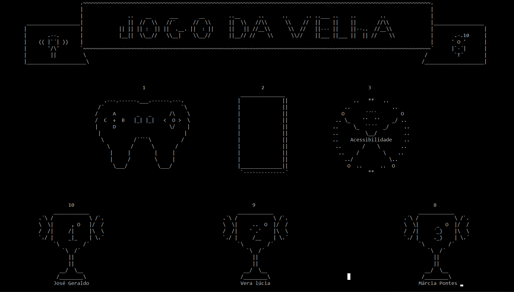

# Jogo Da Velha Acessível
Criado no segundo semestre da faculdade, entre projeto visava ampliar os conceitos de programação aprendidos até a data para concepção de um jogo da velha em Linguagem C. Eu quis ir um pouco além, apresentando propostas, apenas conceituais, de acessibilidade aplicada ao jogo.  Obs: O programa se encontra com seu código original, não foi realizado refatoração. Sendo seu código-fonte datado de ‎17‎/06/‎2019, período onde estava aprendendo programação com C, no segundo semestre da faculdade. 

</diiv>
